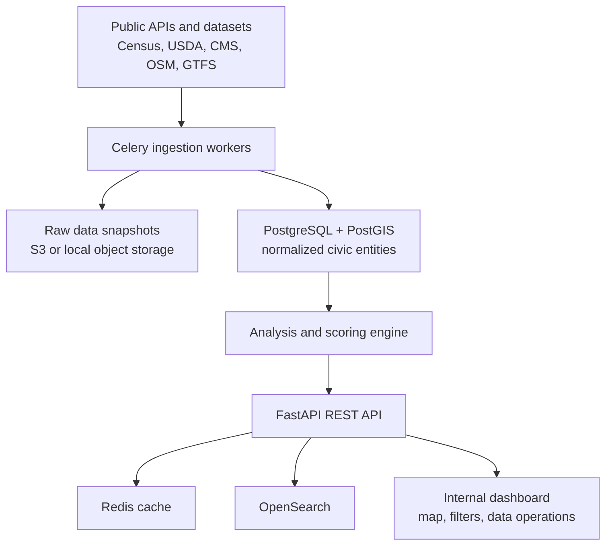

# Civic Access Index

Civic Access Index is a Python-based geospatial data platform for identifying census
tracts with overlapping access gaps in healthcare, food, transportation, and
socioeconomic vulnerability.

The project is designed as an operational data system rather than a consumer-facing
app: it includes asynchronous ingestion workers, source-level provenance,
data-quality tracking, PostGIS analysis, cached APIs, searchable entities,
infrastructure-as-code deployment, and a lightweight internal dashboard.

## System Shape



## Subsystems

1. **Ingestion**: source adapters fetch public datasets, persist raw snapshots, create
   auditable ingestion runs, and record rejected rows as data-quality issues.
2. **Normalization**: canonicalizes categories, addresses, providers, tract geography,
   and public-source payloads into stable models.
3. **Geospatial analysis**: computes tract-level metrics, percentiles, and transparent
   service-gap scores.
4. **API/search/cache layer**: exposes FastAPI endpoints, cached hot queries, and
   optional OpenSearch-backed faceted search.
5. **Dashboard + observability**: provides a map-oriented analyst UI, health endpoints,
   structured logs, and ingestion-run visibility.

## Local Development

Copy environment defaults if you want local overrides:

```powershell
Copy-Item .env.example .env
```

Start the full local stack:

```powershell
docker compose up --build
```

Useful URLs:

- API: http://localhost:8000
- OpenAPI docs: http://localhost:8000/docs
- Health: http://localhost:8000/healthz
- Dashboard: http://localhost:5173
- OpenSearch: http://localhost:9200

## First Milestones

- **Milestone 1**: FastAPI app, PostGIS database, Alembic migrations, Celery worker,
  Redis, structured logs, health endpoints, and ingestion-run tables.
- **Milestone 2**: Massachusetts census tract geometries and ACS vulnerability fields.
- **Milestone 3**: OSM amenities and CMS provider ingestion.
- **Milestone 4**: tract-level metrics, distance calculations, and vulnerability
  percentiles.
- **Milestone 5**: Civic Access Index scoring with explanation objects and limitations.
- **Milestone 6**: map dashboard, tract side panel, and data operations page.
- **Milestone 7**: OpenSearch indexing, Terraform-managed AWS deployment, and CI/CD.

## Scoring V1

The first transparent scoring formula is intentionally plain:

```text
Civic Access Index =
  0.35 * healthcare_gap_score
+ 0.25 * food_gap_score
+ 0.20 * transit_gap_score
+ 0.20 * socioeconomic_vulnerability_score
```

Each subscore is percentile-normalized from tract-level metrics. Score explanations
include the main drivers and limitations so the platform remains inspectable rather
than pretending to be definitive policy advice.

## API Surface

Initial endpoint groups:

- `/healthz`, `/readyz`, `/version`
- `/api/tracts`, `/api/tracts/{geoid}`, `/api/tracts/{geoid}/metrics`,
  `/api/tracts/{geoid}/explanation`, `/api/tracts/{geoid}/nearby-amenities`
- `/api/amenities`, `/api/providers`, `/api/search`
- `/api/scores/top`, `/api/scores/distribution`
- `/api/ingestion-runs`, `/api/data-sources`
- `/api/admin/ingest/{source_name}`, `/api/admin/recompute-scores`,
  `/api/admin/reindex-search`

## Public-Interest Caveat

Civic Access Index is not policy advice and is not a definitive equity model. It is a
data-integration and analysis platform that demonstrates how heterogeneous civic
datasets can be operationalized into inspectable geospatial metrics.

